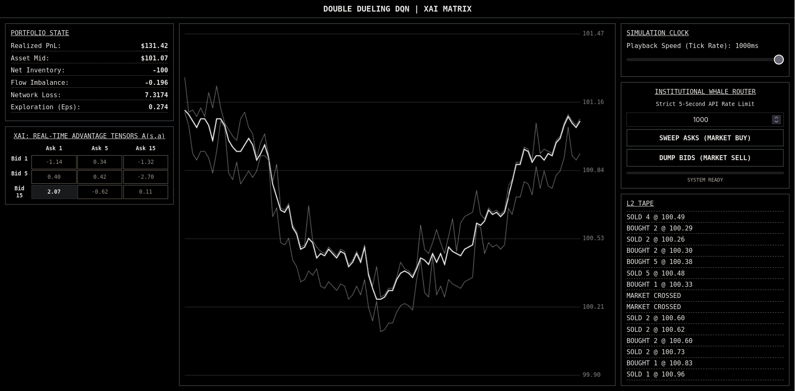

# Deep HFMM: Double Dueling DQN Market Maker



## Overview
This repository contains a high-frequency market making (HFMM) simulation environment and an reinforcement learning agent. The system uses a Double Dueling Deep Q-Network (DDDQN) to manage inventory risk and capture bid-ask spreads within a synthetic limit order book. The backend is built with FastAPI and PyTorch, serving a vanilla HTML5/JavaScript frontend for real-time telemetry.

## System Architecture

### 1. Neural Network Engine (DDDQN)
The agent utilizes a Dueling architecture to separate the estimation of the state's inherent value from the advantage of specific actions.

* **Value Stream $V(s)$:** Evaluates the risk of the current market state (e.g., holding a large position during high volatility).
* **Advantage Stream $A(s, a)$:** Evaluates the relative benefit of selecting a specific quote depth combination.
* **Recombination:** The streams are aggregated at the output layer using the following formula:
    $$Q(s, a) = V(s) + \left( A(s, a) - \frac{1}{|\mathcal{A}|} \sum_{a'} A(s, a') \right)$$
* **Target Network:** Employs Polyak averaging (soft updates) with $\tau = 0.005$ to update the target network weights and stabilize training.

### 2. Market Environment Dynamics
The simulator models market microstructure mechanics to train the agent against adverse selection and toxic flow:
* **Order Book Imbalance (OBI):** Modeled using a discrete Ornstein-Uhlenbeck stochastic differential equation to simulate autocorrelated institutional order flow.
* **State Space (5D Continuous):** Normalized Net Inventory, OBI, Whale API Cooldown Ratio, Rolling 20-Tick Momentum, and Micro-Volatility.
* **Action Space (9D Discrete):** Nine permutations of Bid and Ask tick depths relative to the true mid-price.
* **Reward Shaping:** The raw step profit/loss is adjusted using a rolling Sortino ratio (to penalize downside deviation) and an Avellaneda-Stoikov quadratic inventory penalty: $Penalty = 0.5 \times (\frac{Inventory}{Limit})^2$.

### 3. Backend & Session Management
* [cite_start]**Framework:** FastAPI serving asynchronous HTTP endpoints.
* **Concurrency:** Multi-tenant session isolation is handled via client-side cryptographic UUIDs. 
* **Garbage Collection:** Environments inactive for 5 minutes are destroyed to prevent memory leaks.

## Installation & Setup

### Prerequisites
* Python 3.10+
* Docker (Optional)

### Local Deployment
1. [cite_start]Install dependencies from the `requirements.txt` file:
   ```bash
   pip install -r requirements.txt
